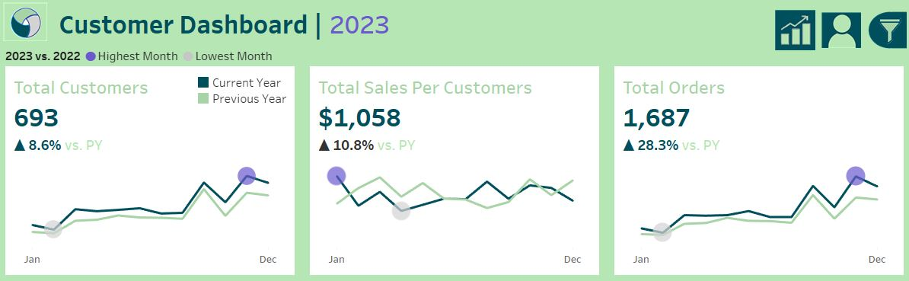

# Sales Trend Analysis: 2022 vs. 2023

## Project Background
This analysis was conducted for a company operating in the consumer goods industry, focusing on a diverse range of products including office supplies, electronics, and furniture. The company employs a multi-channel business model, selling directly to consumers through both online and physical stores. With the data primarily focusing on the years **2022 and 2023**, our aim was to uncover actionable insights to drive sales strategies and enhance customer satisfaction. Key business metrics include Total Sales, Profits, and Customer Behavior Trends.

Our **North Star** metric for this project is **Total Sales**, as it directly reflects the company's revenue-generating capabilities and overall business health. The key performance indicators (KPIs) we tracked include:
- Total Profits
- Total Quantity Sold
- Total Orders
- Number of Customers
- Sales per Customer

Insights and recommendations are provided on the following key areas:
- Sales Performance Comparison: Analysing year-over-year sales trends.
- Profitability Analysis: Identifying which categories drive profits.
- Customer Behaviour Insights: Understanding how customer engagement has changed.
- Weekly Sales Patterns: Analysing fluctuations in sales and profits on a weekly basis.

A set of interactive **Tableau dashboards** used to report and explore sales trends can be found [here](https://public.tableau.com/views/SalesCustomerDashboardsDynamic_17296122448070/SalesDashboard?:language=en-GB&:sid=&:redirect=auth&:display_count=n&:origin=viz_share_link).

## Data Structure
The company’s main database structure consists of four tables, with a total row count of approximately 10,000 records. A description of each table is as follows:

The **SQL queries** used to inspect and clean the data for this analysis can be found [here](https://github.com/HamidSherz/Retail-Sales-Analysis-2023/blob/main/data_cleanup.sql).

## Executive Summary
This analysis reveals a significant increase in total sales from 2022 to 2023, highlighting a growth of approximately 20%. Notably, categories such as Phones and Appliances demonstrated impressive growth rates, while certain subcategories, like Machines and Envelopes, showed a decline. These insights suggest a need for targeted marketing strategies to boost performance in underperforming categories.

Additionally, while total sales have increased, profit margins have declined due to rising operational costs and strategic discounts. Stakeholders should focus on optimizing pricing strategies and cost management to enhance profitability without sacrificing customer satisfaction.

## Insights Deep Dive

### Sales Trends
- Total sales for 2023 showed a significant increase compared to 2022, with annual totals rising from $609K in 2022 to $733K in 2023, marking a growth of around 20%. Correspondingly, the total quantity of units sold increased from 10K in 2022 to 12K in 2023. Monthly totals ranged from $20K in February to a peak of $118K in November, which alone accounted for approximately 28% of the total annual sales. The upward trend was driven largely by holiday shopping patterns and promotional events such as Black Friday.

  

- Profit margins also improved in 2023, with total profits rising from $82K in 2022 to $93K in 2023, an increase of around 13%. November profits showed a remarkable improvement, reaching $10K, up from $4K in November 2022, a 150% year-over-year increase, likely due to better pricing strategies and cost management during key sales periods. However, December 2023 profits fell below $10K, contrasting sharply with December 2022, where profits exceeded $15K, highlighting a need for further analysis into the factors affecting December performance.

  

- Product category analysis highlighted that Phones and Accessories accounted for 35% of total sales in 2023, contributing to 42% of total profits. Categories such as Machines and Envelopes underperformed, making up less than 5% of total sales. The strong demand for Phones was likely driven by new product releases and strategic marketing.

  

- Weekly sales patterns showed notable spikes during promotional periods, particularly between weeks 12 and 13, where sales surged to $27K and profits reached $9K. This increase was followed by a significant decline, with sales dropping to $4K by week 16 and profits plummeting to -$3K in week 17. Overall, sales volume increased by 40% during key events in November and December, largely driven by holiday shopping and limited-time discounts that attracted a surge of customer activity.

  

### Customer Behaviour
- In 2023, customer behavior showed a marked shift compared to 2022. The total number of orders increased from 1,315 in 2022 to 1,687 in 2023, reflecting a significant rise in customer engagement and repeat purchases. Notably, customers who made multiple purchases increased by 20%, suggesting a strengthening in customer loyalty. This trend indicates effective engagement strategies that successfully prompted repeat purchases, particularly during the Q4 period.

- The total number of customers increased significantly in 2023, with a peak of 216 in November, representing a 35% increase compared to 2022. Year-over-year analysis shows that new customer acquisition grew consistently, peaking during holiday promotions in both years. This surge can be attributed to successful marketing campaigns targeting new customer acquisition and holiday promotions.

  

- Total sales per customer fluctuated throughout the year, with Q4 showing a notable decrease. In December, total sales per customer reached $430, reflecting a 24.77% decrease from the average of $572 in October and $548 in November. This decline may be attributed to the end of holiday season sales, leading to a return to normal levels by October. Additionally, there was a spike in August, where sales per customer reached $607 despite the number of orders being around 100. This was followed by a decline in September to $448, despite an increase in the number of orders to over 200. Compared to 2022, the Q4 dip in sales per customer is more pronounced, potentially indicating that higher discounting strategies had a bigger impact this year.

- A detailed assessment of customer order frequency shows that 45% of customers made multiple purchases throughout the year, indicating strong loyalty. This group contributed to 60% of total sales, highlighting the importance of retention strategies. The top 10 customers notably influenced profitability, emphasizing the need for targeted marketing efforts.

## Recommendations
Based on the insights and findings above, we recommend the following:
1. **Targeted Marketing:** Focus efforts on underperforming categories like Machines and Envelopes, which generated less than 5% of total sales in 2023 (approximately $36.5K). Consider analyzing customer segments that may be more responsive to promotions within these categories. Implement targeted campaigns to revitalize interest in these categories.
2. **Customer Engagement Strategies:** Enhance loyalty programs for segments that showed significant growth, particularly those contributing to 60% of total sales in 2023 (about $439.8K). Leverage insights from customers who made multiple purchases, as their engagement grew by 20%. Personalized communication and rewards can drive repeat purchases.
3. **Promotional Campaigns:** Leverage insights from peak sales weeks, especially during Q4, which saw sales rise by 40% due to holiday promotions. Consider comparing promotional impact across customer segments and adjusting offers for maximum impact. Integrating personal ads to tailor offers based on customer preferences and shopping behaviour could replicate the success seen by subscription services.
4. **Product Bundling:** Explore bundling popular products, like Phones and Accessories, which accounted for 35% of total sales. Strategic bundling can boost sales across categories, potentially increasing overall revenue.
5. **Dynamic Pricing Strategies:** Investigate dynamic pricing models that adjust based on demand fluctuations. The significant profit increase in November (150% year-over-year) highlights opportunities to optimize pricing during high-demand periods.

## Assumptions and Caveats
Throughout the analysis, multiple assumptions were made to manage challenges with the data. These include:
- **Data Completeness:** It is assumed that all sales data from 2020 to 2023 is complete and accurately recorded, particularly for high-volume sales periods such as Q4.
- **Product Categorization:** The analysis assumes that all products have been consistently categorized, which influences sales and profitability insights. Any misclassification could affect the results.
- **Customer Behaviour Trends:** The insights regarding customer engagement and behaviour assume that patterns observed in 2022 and 2023 are representative and will continue into future periods, barring any significant market changes.
- **Promotional Impact:** It is assumed that the promotional events analysed had a uniform impact across all customer segments, which may not account for variations in individual customer responses.
